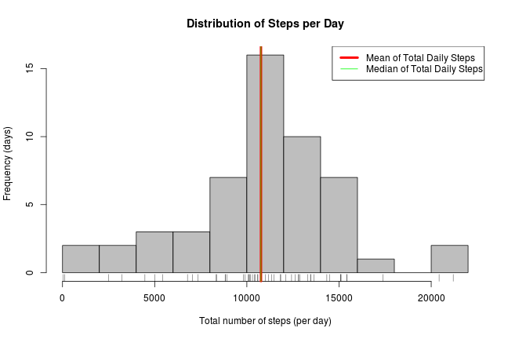

# Reproducible Research: Peer Assessment 1

This report persents an analysis of the walking paterns of an anonymous individual sampled every five minutes using a [Fitbit](http://www.fitbit.com/) device during a period of 2 months.

## Loading and preprocessing the data

First, I read the raw data from the CSV file into an R dataframe and examined the contents of the variables (question #1):


```r
dat <- read.csv("activity.csv")
summary(dat)
```

```
##      steps               date          interval   
##  Min.   :  0.0   2012-10-01:  288   Min.   :   0  
##  1st Qu.:  0.0   2012-10-02:  288   1st Qu.: 589  
##  Median :  0.0   2012-10-03:  288   Median :1178  
##  Mean   : 37.4   2012-10-04:  288   Mean   :1178  
##  3rd Qu.: 12.0   2012-10-05:  288   3rd Qu.:1766  
##  Max.   :806.0   2012-10-06:  288   Max.   :2355  
##  NA's   :2304    (Other)   :15840
```

Next, we need to process the data (question #2.) The summary shows that the date was imported as a "character" factor, so I converted it to a true "date" variable. I also combined the information of the date and interval variables into a single "datetime" variable (just in case we may need them together for plotting or analysis.) The following pre-processing steps did this:


```r
dat$datetime <- as.POSIXct(dat$date) + dat$interval*60
dat$date     <- as.Date(dat$date, format="%Y-%m-%d")
```

Now the dataset is processed and ready for analysis (except for the missing values which will be dealt with later.)


## What is mean total number of steps taken per day?

To answer this question, I aggregated the data at the daily level and then examined the resulting table. The two tables below show the "total number of steps" for the first few days and for the last few days of the study, respectively:


```r
datDailyTotals   <- aggregate(steps~date, data=dat, FUN=sum)
head(datDailyTotals)
```

```
##         date steps
## 1 2012-10-02   126
## 2 2012-10-03 11352
## 3 2012-10-04 12116
## 4 2012-10-05 13294
## 5 2012-10-06 15420
## 6 2012-10-07 11015
```

```r
tail(datDailyTotals)
```

```
##          date steps
## 48 2012-11-24 14478
## 49 2012-11-25 11834
## 50 2012-11-26 11162
## 51 2012-11-27 13646
## 52 2012-11-28 10183
## 53 2012-11-29  7047
```

It appears that the counts of the first and last record are imcomplete (since they are much lower than those of the contiguous days) which could cause the results to be understated. Additionally two dates seem to be completely missing (Oct 1st and Nov 30th.) For the purpose of this assignment, I will leave the dataset as is. But in a longer project, I would certainly research why is this happening. And depending on the findings, I may discard some records as invalid or outliers.

Next, I calculated the required statistics (mean & median) and ploted the histogram. Here are the answers to both questions (1 & 2):


```r
meanDailyTotal   <- mean(datDailyTotals$steps)
medianDailyTotal <- median(datDailyTotals$steps)
hist(datDailyTotals$steps, 
     breaks=10, 
     col="gray", 
     main="Distribution of Steps per Day",
     xlab="Total number of steps (per day)",
     ylab="Frequency (days)")
rug(datDailyTotals$steps)
legend("topright",c("Mean of Total Daily Steps","Median of Total Daily Steps"), lty=1, lwd=c(4,1), col=c("red","green"))
abline(v=meanDailyTotal,   lwd=4, col="red")
abline(v=medianDailyTotal, lwd=1, col="green")
```

 

```r
cat("Mean steps per day =",meanDailyTotal,"and median steps per day =",medianDailyTotal,"\n")
```

```
## Mean steps per day = 10766 and median steps per day = 10765
```


## What is the average daily activity pattern?

To answer this question, I aggregated the data at the "5-minute interval" level, calculated key statistics for each interval time, and looked at the data again: 


```r
datIntervalTotals   <- aggregate(dat$steps~dat$interval, FUN=mean, na.rm=T)
datIntervalTotals2  <- tapply(dat$steps, dat$interval, quantile, probs=c(0,.25,.50,0.75,1), na.rm=T)
datIntervalTotals2  <- do.call(rbind,datIntervalTotals2)
datIntervalTotals   <- cbind(datIntervalTotals, datIntervalTotals2)
colnames(datIntervalTotals) <- c("interval","mean","min","Q1","Q2","Q3","max")
rownames(datIntervalTotals) <- NULL
head(datIntervalTotals)
```

```
##   interval    mean min Q1 Q2 Q3 max
## 1        0 1.71698   0  0  0  0  47
## 2        5 0.33962   0  0  0  0  18
## 3       10 0.13208   0  0  0  0   7
## 4       15 0.15094   0  0  0  0   8
## 5       20 0.07547   0  0  0  0   4
## 6       25 2.09434   0  0  0  0  52
```

Below is the requested time series plot of the average number of steps taken per 5-minute interval, averaged across all days. Although it was not requested, I added the median as well:


```r
plot(datIntervalTotals$interval, datIntervalTotals$mean, 
     type = "l", 
     col="red", 
     lwd=4,
     xlab="Time Interval", 
     ylab="Number of Steps")
lines(datIntervalTotals$interval, datIntervalTotals$Q2, col="green")
legend("topright",c("Average steps (across all days)","Median steps (across all days)"), lwd=c(4,1), lty=1, col=c("red","green"))
```

 

And now we can determine which 5-minute interval, on average across all the days in the dataset, contains the maximum number of steps (question #2):


```r
busiest_interval       <- which.max(datIntervalTotals$mean)
busiest_interval_nbr   <- datIntervalTotals$interval[busiest_interval]
busiest_interval_steps <- datIntervalTotals$mean[busiest_interval]
cat('On average, the most number of steps happened at time interval',busiest_interval_nbr,'and the average number of steps at that point was',busiest_interval_steps,'per day.\n')
```

```
## On average, the most number of steps happened at time interval 835 and the average number of steps at that point was 206.2 per day.
```


## Imputing missing values

The next step is to calculate the number of missing values in the dataset (question #1.) Here are the results:


```r
miss_steps <- sum(is.na(dat$steps))
miss_dates <- sum(is.na(dat$date))
miss_intrs <- sum(is.na(dat$interval))
cat("The number of mising step values is",miss_steps,"while missing dates are",miss_dates,"and missing time intervals are",miss_intrs,"\n")
```

```
## The number of mising step values is 2304 while missing dates are 0 and missing time intervals are 0
```

So, the date and time variables are fully populated but the steps variable has some missing values which we need to impute. We are asked to devise an adequate strategy to do so (question #2.)  Here are my thoughts:
- We could use the mean (or median) number of steps for each day as the imputed value, but that approach doesn't account for the fact that the number of steps varies with the time of day (e.g. the interval.)  
- Similarly, we could use the mean or median of the time interval, but that would ignore the valiability of steps across different days. 
- So, I will use an approach that takes the average number of steps for the day but adjusts it (proportionally) for the given time.  This approach is relatively simple and accurate enough for the specifications given in this question.  

Here is the process that imputes those missing values using the selected strategy and creates a new dataset (question #3): 


```r
#Calculate inputs for the imputation:
datDailyMeans <- aggregate(steps~date, data=dat, FUN=mean, na.rm=T)
overallMean   <- mean(dat$steps, na.rm=T)  
#Create a new dataset equal to the original but with missing data filled in:
datNew <- dat
for (i in 1:nrow(dat)) {
    if (is.na(dat$steps[i])) {
        #Found a missing value... get the corresponding date and time interval
        miss_date <- dat$date[i]
        miss_int  <- dat$interval[i]
        #Get the average number of steps for that day and interval
        dayMean      <- datDailyMeans[datDailyMeans$date==miss_date,"steps"]
        intervalMean <- datIntervalTotals[datIntervalTotals$interval==miss_int,"mean"]
        #If the day's data was completely missing, then set steps to zero for that day
        if (length(dayMean)==0) {dayMean <- 0}
        #Impute the value adjusting proportionally
        datNew$steps[i] <- dayMean * (intervalMean / overallMean)
    }
}
```

After running that process, we should probably check the new dataframe for missing values (just to confirm that none are left.)


```r
miss_steps_new <- sum(is.na(datNew$steps))
cat("The number of mising step values which originally was",miss_steps,"is now",miss_steps_new,"after the imputation.\n")
```

```
## The number of mising step values which originally was 2304 is now 0 after the imputation.
```

Excellent! The new dataset is complete. The last part of this question is to repeat the histogram and mean calculations and determine how different the results are (question #4.) Here is the answer:


```r
datDailyTotalsNew   <- aggregate(steps~date, data=datNew, FUN=sum)
meanDailyTotalNew   <- mean(datDailyTotalsNew$steps)
medianDailyTotalNew <- median(datDailyTotalsNew$steps)
hist(datDailyTotalsNew$steps, 
     breaks=10, 
     col="gray", 
     main="Distribution of Steps per Day (After Imputation)",
     xlab="Total number of steps (per day)",
     ylab="Frequency (days)")
rug(datDailyTotalsNew$steps)
legend("topright",
       c("New Mean of Total Daily Steps","New Median of Total Daily Steps","Original Mean","Original Median"), 
       lty=c(1,1,2,2), 
       lwd=c(4,1,4,1), 
       col=c("red","green"))
abline(v=meanDailyTotalNew,   lwd=4, col="red")
abline(v=medianDailyTotalNew, lwd=1, col="green")
abline(v=meanDailyTotal,   lwd=4, lty=2, col="red")
abline(v=medianDailyTotal, lwd=1, lty=2, col="green")
```

 

```r
cat("Mean steps per day =",meanDailyTotalNew,"and median steps per day =",medianDailyTotalNew,"\n")
```

```
## Mean steps per day = 9354 and median steps per day = 10395
```

```r
cat("The change in the mean is =",meanDailyTotalNew-meanDailyTotal,"and the change in the median is =",medianDailyTotalNew-medianDailyTotal,"\n")
```

```
## The change in the mean is = -1412 and the change in the median is = -370
```

So, in conclusion, when we imputed missing values the median dropped a little bit (not too much) and the mean dropped significantly. This is likely due to the zeros that were added to the distribution (because those days didn't have any steps recorded.) That is something that would have to be further investigated. We would have to confirm why we are missing those steps. Perhaps the fitbit device was not properly setup. Or the battery was not charged. Maybe we need to exclude some specific days from the analysis (in order to ensure that only data of good quality is used.) But if we determine that the device was working properly and the person just didnt walk on those days (maybe it was sick and stayed in bed) in that case it may be correct to include the zeroes in the analysis because it accurately represents what the subject did. 

## Are there differences in activity patterns between weekdays and weekends?

First we need to create a new factor variable in the dataset indicating whether a given date is a weekday or weekend day (question #1.)


```r
datNew$weekday = weekdays(datNew$date)
datNew$daytype <- as.factor(ifelse(datNew$weekday=="Saturday" | datNew$weekday=="Sunday","Weekend","Weekday"))
```

Finally, we are ready to create the pannel plot (question #2):


```r
library(lattice) 
#Aggregate data (average steps) by interval and daytype
datPlot <- aggregate(steps~interval+daytype, data=datNew, FUN=mean, na.rm=T)
#Plot average steps by interval and daytype
xyplot(steps ~ interval | daytype,
    data=datPlot,
    type = "l",
    xlab="5-minute time interval",
    ylab="Average number of steps",
    layout=c(1,2)
    )
```

 

One can observe some differences in the patterns:
- The subject starts walking earlier on weekdays (there is a spike before 6AM) compared to the weekends (slower and more variable start between 7 and 8AM).
- Weekdays have a peak around 8:30 AM likely because the person is going to work, which happens at a regular time. Weekends dont show this peak.
- Weekends have more activity throughout the day between 10AM - 5PM. The subject seems to be going out and walking more during the weekends. During the week the subject is likely spending more time in his desk, hence the lower counts in this time interval.
- Subject seems to be winding down a little bit later on the weekends than in weekdays (but not by much.)
